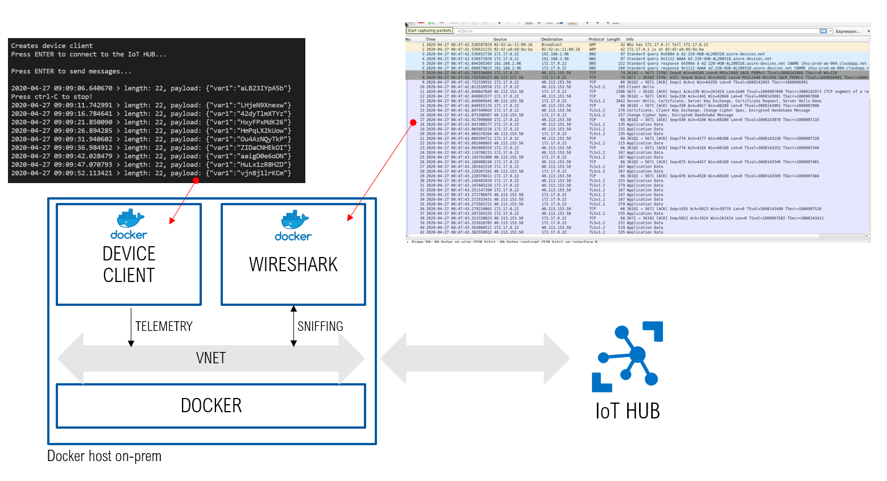
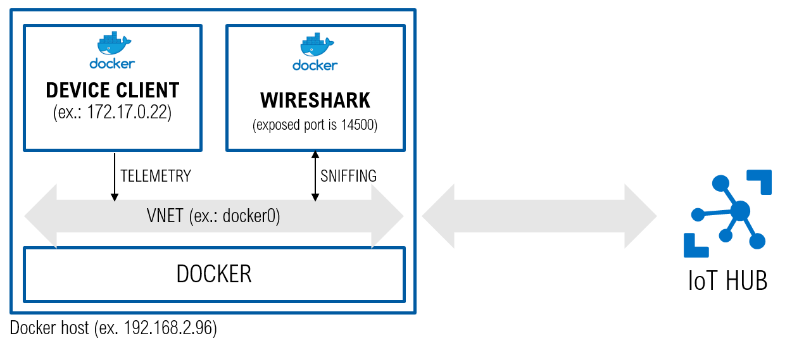
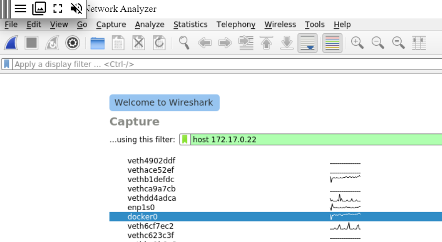

# Overview
A docker-based setup to analyze the traffic between a simulated IoT Device on-prem and the Azure IoT HUB using Wireshark. 

## How to use it
* run the dockerized Wireshark as follows (additional details [here](https://github.com/ffeldhaus/docker-wireshark)):

`docker -H <docker-host-ip> run -p 14500:14500 --restart unless-stopped --name wireshark --cap-add NET_ADMIN ffeldhaus/wireshark`

* run the dockerized Device Client simulator, as follows ( [here](./device-client-docker/README.md) additional details about parameters, .env file, how to build it, how it works):

`docker -H <docker-host-ip> run -it --env-file ./.env arlotito/my-iot-device-simulator:0.1 <params>`

## Traffic analysis
Let's assume that:
* both the device client and wireshark dockers have been deployed 
* the docker VNET is named `docker0`
* the device client IP is  `172.17.0.22`
* Wireshark is exposing the port `14500` to the host
* the docker host ip is `192.168.2.96`

To capture and analyze the data through Wireskark:

1. connect to wireshark opening the url `https://192.168.2.96:14500/?username=wireshark&password=wireshark` with a browser
2. select the network (`docker0`) and enter a capture filter (`host 172.17.0.22`)

