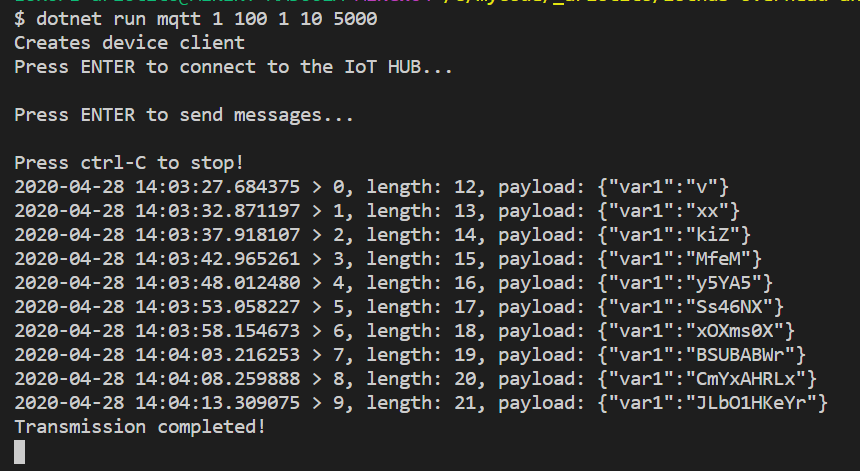

# Overview
An IoT Device simulator to send telemetry messages to the IoT HUB with variable length and random payload allowing for traffic analysis.

It sends telemetry messages with the following structure:

```csharp
var telemetryDataPoint = new
{
    var1 = RandomString(length)
};
```

where the value of `var1` is a random string which length is increased at each transmission starting from `stringLengthMin` to `stringLengthMax` with an increment step `step`. 

Transmission stops when either when `stringLengthMax` or `maxNumOfMessages` are reached. Messages are sent with an interval=`intervalMilliseconds`.

The `protocol` can be mqtt, amqp or http1.

The IoT HUB connection string is passed through the environment variable `IOTHUB_CONN_STRING_CSHARP`.


## How to run it
```
export IOTHUB_CONN_STRING_CSHARP="HostName=xxxxxxxx"
dotnet run <protocol> <stringLengthMin> <stringLengthMax> <step> <maxNumOfMessages> <intervalMilliseconds>
```

## Example
```
dotnet run mqtt 1 100 1 10 5000
```

It will send telemetry messages with payload `{"var1":<string>}` as follows:
* using mqtt
* `<string>` is a random string with length starting from 1 (1st message) and incremented by 1 after each transmission up to a length = 100
* it will stop after 10 messages sent 
* a message is sent every 5000ms (i.e. 5 seconds)

Here's the output:

 

## Build the docker image
To build the docker image:
```
./build.sh <docker_host> <repo/image:tag>
```

Example:
```
./build.sh 192.168.2.96 arlotito/my-iot-device-simulator
```

## Run the docker image
Create an `.env` file with the IoT HUB connection string as follows:
```
IOTHUB_CONN_STRING_CSHARP="HostName=xxx"
```

Run the container as follows:
```
./run.sh <docker_host> <repo/image:tag> <params>
```

Example:
```
./run.sh 192.168.2.96 arlotito/my-iot-device-simulator mqtt 1 100 1 10 5000
```

where `<params>` are the parameters explained above.